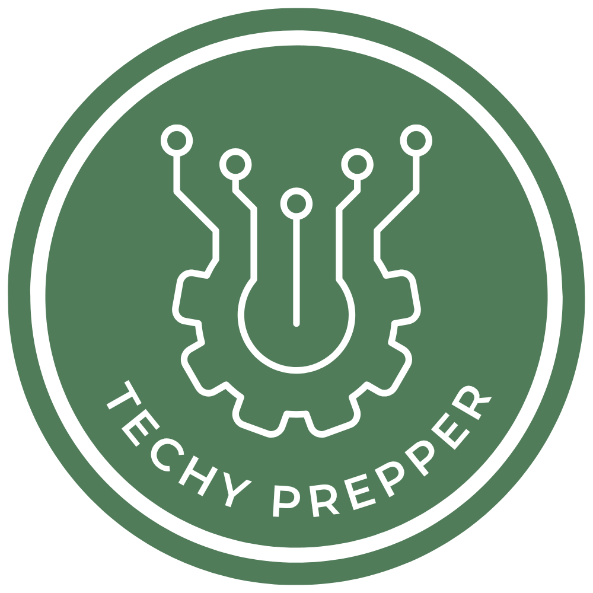

<p align="center">
  
</p>

# Offgrid Electronics — Tech Survival USB Stick

A comprehensive offline documentation and tooling repository for electronics development, radio communications, and mesh networking. Everything you need to keep building when the internet goes dark.

## Download

Grab the latest release from the [Releases page](https://github.com/jscrobinson/offgrid-electronics/releases/latest). Each release includes pre-built zips:

| Zip | Contents | Size |
|---|---|---|
| **core** | HTML docs site, markdown source, scripts, config | ~2 MB |
| **toolchains** | Arduino IDE, ESP-IDF, PlatformIO | ~1.6 GB |
| **editors** | VS Code portable + extensions, micro editor | ~550 MB |
| **mirrored-docs** | Python, Node.js, Arduino, ESP-IDF, Meshtastic offline docs | ~250 MB |
| **extras** | SDR software, CHIRP, firmware, datasheets, cached npm/pip packages | ~240 MB |

**To use:** Download all zips and extract them into the same folder. Open `index.html` in a browser to get started.

> Docker images are not included in releases (too large). Run `make docker` locally to pull and save them.

## What's Inside

- **Hardware References** — Raspberry Pi, Arduino, ESP32, LoRa (T-Beam 1.2, Heltec V3), displays, sensors
- **Electronics Fundamentals** — Components, circuits, soldering, test equipment
- **Communication Protocols** — I2C, SPI, UART, MQTT, Modbus
- **Radio & SDR** — Amateur radio, Baofeng/JucJet programming, CHIRP, RTL-SDR, SDR#, GQRX, GNU Radio
- **Mesh Networking** — Meshtastic, MeshCore, and Reticulum for T-Beam and Heltec
- **Power Systems** — Batteries, solar charging, power calculations
- **Programming** — Python, MicroPython, Node.js, C/C++ embedded, bash
- **Networking** — IP, WiFi AP mode, SSH, WireGuard
- **Offline Toolchains** — Arduino IDE, ESP-IDF, PlatformIO, VS Code portable
- **Cached Packages** — npm and pip packages for offline installs
- **Docker Images** — Node, Python, Mosquitto, Portainer (saved as .tar)
- **SDR Software** — SDR#, GQRX, CubicSDR, GNU Radio, rtl_433, dump1090

## Quick Start

```bash
# Build everything (requires internet)
make all

# Copy to USB (64 GB recommended)
make usb USB=/mnt/e

# Lite version without Docker images (fits 32 GB)
make usb-lite USB=/mnt/e

# Verify USB integrity
make verify USB=/mnt/e

# Check total size
make size
```

## Recommended USB: 64 GB

| Category | Est. Size |
|---|---|
| Authored markdown docs | ~5 MB |
| Mirrored docs | ~500 MB |
| DevDocs offline bundle | ~2 GB |
| Docker images | ~8-12 GB |
| Toolchains | ~2.5 GB |
| VS Code portable + extensions | ~500 MB |
| npm/pip packages | ~3-8 GB |
| Datasheets | ~500 MB |
| SDR software | ~1-2 GB |
| CHIRP + radio files | ~100 MB |
| **Total** | **~20-30 GB** |

## Using the USB Offline

Plug in the USB and open `START_HERE.html` in any browser. See `docs/survival/usb-stick-usage-guide.md` for full instructions.

## Building

Requires: bash, curl, wget, git, docker (optional), npm (optional), pip (optional)

```bash
# Mirror documentation only
make docs mirror

# Download toolchains and editors
make toolchains editors

# Download SDR software
make sdr

# Download Docker images (optional, ~10 GB)
make docker

# Cache npm/pip packages
make packages
```

## Support

If you find this project useful, consider making a donation to support continued development:

<p align="center">
  <a href="https://www.paypal.com/donate/?hosted_button_id=WSDYCN7CUHE98">
    
  </a>
</p>

## Contributing

See [CONTRIBUTING.md](CONTRIBUTING.md) for guidelines on adding docs, fixing issues, and submitting pull requests.

## License

MIT

